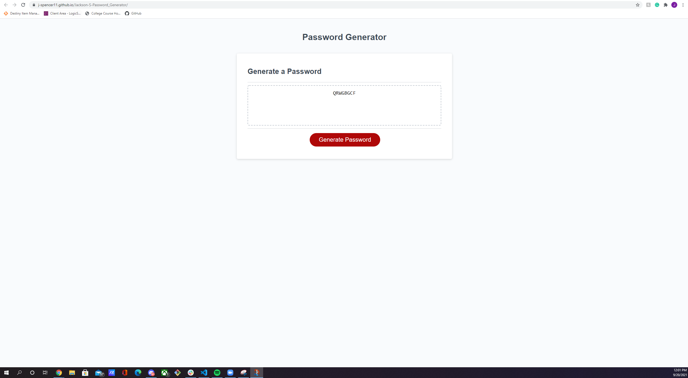

# Jackson-S-Password_Generator

# Description
for this assignment, we had to use javascript to code a website to allow us to generate a random string of characters for a password. It had to have options at the top prompting us to choose the password length; which couldnt be less than 8 or more than 128; and had to have options for what types of characters to include, which were special characters (!#$%&^), numbers (123456), lowercase letters (lowercase), and uppercase letters (UPPERCASE).

# Screenshot

# Links

here is a link to the website: <link>https://j-spencer11.github.io/Jackson-S-Password_Generator/</link>

here is a link to the repo: <link>https://github.com/j-spencer11/Jackson-S-Password_Generator</link>